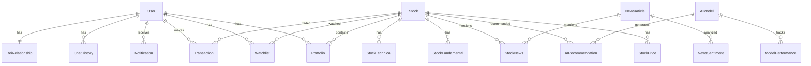

# データベース設計

## 概要

SmartStocks アプリのデータベース設計書です。PostgreSQL をメインデータベース、Redis をキャッシュ・セッション管理に使用します。

## ER図



## テーブル定義

### ユーザー関連

#### users
ユーザーの基本情報

| Column | Type | Constraints | Description |
|--------|------|-------------|-------------|
| id | uuid | PRIMARY KEY | ユーザーID |
| email | varchar(255) | UNIQUE NOT NULL | メールアドレス |
| password_hash | varchar(255) | NOT NULL | パスワードハッシュ |
| name | varchar(100) | NOT NULL | 表示名 |
| role | enum | DEFAULT 'user' | ロール (user, admin) |
| is_active | boolean | DEFAULT true | アカウント有効性 |
| created_at | timestamp | DEFAULT NOW() | 作成日時 |
| updated_at | timestamp | DEFAULT NOW() | 更新日時 |

#### user_profiles
ユーザーの詳細プロフィール

| Column | Type | Constraints | Description |
|--------|------|-------------|-------------|
| user_id | uuid | PRIMARY KEY, FK | ユーザーID |
| risk_tolerance | enum | DEFAULT 'moderate' | リスク許容度 (low, moderate, high) |
| investment_goal | enum | DEFAULT 'growth' | 投資目標 (income, growth, balanced) |
| investment_experience | enum | DEFAULT 'beginner' | 投資経験 (beginner, intermediate, advanced) |
| annual_income | bigint | NULL | 年収 |
| investment_budget | bigint | NULL | 投資予算 |
| time_horizon | enum | DEFAULT 'medium' | 投資期間 (short, medium, long) |
| notification_preferences | jsonb | DEFAULT '{}' | 通知設定 |
| ui_preferences | jsonb | DEFAULT '{}' | UI設定 |
| created_at | timestamp | DEFAULT NOW() | 作成日時 |
| updated_at | timestamp | DEFAULT NOW() | 更新日時 |

#### rei_relationships
れいとの関係性データ

| Column | Type | Constraints | Description |
|--------|------|-------------|-------------|
| user_id | uuid | PRIMARY KEY, FK | ユーザーID |
| affection_level | integer | DEFAULT 50 | 好感度 (0-100) |
| trust_level | integer | DEFAULT 50 | 信頼度 (0-100) |
| interaction_count | integer | DEFAULT 0 | 交流回数 |
| last_interaction | timestamp | NULL | 最後の交流日時 |
| personality_data | jsonb | DEFAULT '{}' | 性格データ |
| memory_data | jsonb | DEFAULT '{}' | 記憶データ |
| mood_history | jsonb | DEFAULT '[]' | 気分履歴 |
| created_at | timestamp | DEFAULT NOW() | 作成日時 |
| updated_at | timestamp | DEFAULT NOW() | 更新日時 |

### 株式関連

#### stocks
銘柄マスターデータ

| Column | Type | Constraints | Description |
|--------|------|-------------|-------------|
| symbol | varchar(20) | PRIMARY KEY | 銘柄コード |
| name | varchar(255) | NOT NULL | 銘柄名 |
| name_en | varchar(255) | NULL | 英語名 |
| market | varchar(50) | NOT NULL | 市場 |
| sector | varchar(100) | NULL | セクター |
| industry | varchar(100) | NULL | 業界 |
| country | varchar(10) | DEFAULT 'JP' | 国 |
| currency | varchar(10) | NOT NULL | 通貨 |
| is_active | boolean | DEFAULT true | 取引可能性 |
| listing_date | date | NULL | 上場日 |
| description | text | NULL | 企業説明 |
| website | varchar(255) | NULL | ウェブサイト |
| created_at | timestamp | DEFAULT NOW() | 作成日時 |
| updated_at | timestamp | DEFAULT NOW() | 更新日時 |

#### stock_prices
株価データ

| Column | Type | Constraints | Description |
|--------|------|-------------|-------------|
| id | bigserial | PRIMARY KEY | ID |
| symbol | varchar(20) | FK NOT NULL | 銘柄コード |
| date | date | NOT NULL | 日付 |
| open | numeric(15,4) | NOT NULL | 始値 |
| high | numeric(15,4) | NOT NULL | 高値 |
| low | numeric(15,4) | NOT NULL | 安値 |
| close | numeric(15,4) | NOT NULL | 終値 |
| volume | bigint | DEFAULT 0 | 出来高 |
| adjusted_close | numeric(15,4) | NULL | 調整後終値 |
| created_at | timestamp | DEFAULT NOW() | 作成日時 |

**Index**: symbol, date (UNIQUE), date

#### stock_fundamentals
ファンダメンタルデータ

| Column | Type | Constraints | Description |
|--------|------|-------------|-------------|
| id | bigserial | PRIMARY KEY | ID |
| symbol | varchar(20) | FK NOT NULL | 銘柄コード |
| period | date | NOT NULL | 期間 |
| period_type | enum | NOT NULL | 期間タイプ (quarterly, annual) |
| market_cap | bigint | NULL | 時価総額 |
| pe_ratio | numeric(10,4) | NULL | PER |
| pb_ratio | numeric(10,4) | NULL | PBR |
| roe | numeric(8,4) | NULL | ROE |
| roa | numeric(8,4) | NULL | ROA |
| debt_ratio | numeric(8,4) | NULL | 負債比率 |
| current_ratio | numeric(8,4) | NULL | 流動比率 |
| dividend_yield | numeric(8,4) | NULL | 配当利回り |
| eps | numeric(15,4) | NULL | EPS |
| bps | numeric(15,4) | NULL | BPS |
| revenue | bigint | NULL | 売上高 |
| net_income | bigint | NULL | 純利益 |
| total_assets | bigint | NULL | 総資産 |
| shareholders_equity | bigint | NULL | 株主資本 |
| created_at | timestamp | DEFAULT NOW() | 作成日時 |

**Index**: symbol, period (UNIQUE)

#### stock_technicals
テクニカル指標データ

| Column | Type | Constraints | Description |
|--------|------|-------------|-------------|
| id | bigserial | PRIMARY KEY | ID |
| symbol | varchar(20) | FK NOT NULL | 銘柄コード |
| date | date | NOT NULL | 日付 |
| sma_5 | numeric(15,4) | NULL | 5日移動平均 |
| sma_25 | numeric(15,4) | NULL | 25日移動平均 |
| sma_75 | numeric(15,4) | NULL | 75日移動平均 |
| ema_12 | numeric(15,4) | NULL | 12日指数移動平均 |
| ema_26 | numeric(15,4) | NULL | 26日指数移動平均 |
| rsi_14 | numeric(8,4) | NULL | 14日RSI |
| macd | numeric(15,4) | NULL | MACD |
| macd_signal | numeric(15,4) | NULL | MACDシグナル |
| macd_histogram | numeric(15,4) | NULL | MACDヒストグラム |
| bb_upper | numeric(15,4) | NULL | ボリンジャーバンド上限 |
| bb_middle | numeric(15,4) | NULL | ボリンジャーバンド中央 |
| bb_lower | numeric(15,4) | NULL | ボリンジャーバンド下限 |
| volume_sma_20 | bigint | NULL | 20日出来高移動平均 |
| created_at | timestamp | DEFAULT NOW() | 作成日時 |

**Index**: symbol, date (UNIQUE)

### AI・分析関連

#### ai_models
AIモデル情報

| Column | Type | Constraints | Description |
|--------|------|-------------|-------------|
| id | uuid | PRIMARY KEY | モデルID |
| name | varchar(100) | NOT NULL | モデル名 |
| version | varchar(20) | NOT NULL | バージョン |
| type | enum | NOT NULL | タイプ (recommendation, sentiment, price_prediction) |
| status | enum | DEFAULT 'training' | ステータス (training, active, deprecated) |
| accuracy | numeric(8,4) | NULL | 精度 |
| parameters | jsonb | DEFAULT '{}' | パラメータ |
| training_data_period | daterange | NULL | 訓練データ期間 |
| deployment_date | timestamp | NULL | デプロイ日時 |
| created_at | timestamp | DEFAULT NOW() | 作成日時 |
| updated_at | timestamp | DEFAULT NOW() | 更新日時 |

#### ai_recommendations
AI推奨データ

| Column | Type | Constraints | Description |
|--------|------|-------------|-------------|
| id | uuid | PRIMARY KEY | 推奨ID |
| user_id | uuid | FK NOT NULL | ユーザーID |
| model_id | uuid | FK NOT NULL | モデルID |
| symbol | varchar(20) | FK NOT NULL | 銘柄コード |
| score | numeric(8,4) | NOT NULL | スコア (0-100) |
| confidence | numeric(8,4) | NOT NULL | 信頼度 (0-1) |
| reason | text | NULL | 推奨理由 |
| rei_comment | text | NULL | れいのコメント |
| risk_level | enum | NOT NULL | リスクレベル (low, moderate, high) |
| expected_return | numeric(8,4) | NULL | 期待リターン |
| recommended_weight | numeric(8,4) | NULL | 推奨ウェイト |
| tags | varchar(50)[] | DEFAULT '{}' | タグ |
| expires_at | timestamp | NULL | 有効期限 |
| created_at | timestamp | DEFAULT NOW() | 作成日時 |

**Index**: user_id, created_at, score

#### model_performance
モデルパフォーマンス追跡

| Column | Type | Constraints | Description |
|--------|------|-------------|-------------|
| id | bigserial | PRIMARY KEY | ID |
| model_id | uuid | FK NOT NULL | モデルID |
| evaluation_date | date | NOT NULL | 評価日 |
| metric_type | varchar(50) | NOT NULL | メトリックタイプ |
| metric_value | numeric(15,8) | NOT NULL | メトリック値 |
| symbol | varchar(20) | FK NULL | 銘柄コード（個別評価時） |
| evaluation_period | daterange | NOT NULL | 評価期間 |
| notes | text | NULL | 備考 |
| created_at | timestamp | DEFAULT NOW() | 作成日時 |

### ユーザー活動関連

#### portfolios
ポートフォリオ

| Column | Type | Constraints | Description |
|--------|------|-------------|-------------|
| id | uuid | PRIMARY KEY | ポートフォリオID |
| user_id | uuid | FK NOT NULL | ユーザーID |
| name | varchar(100) | NOT NULL | ポートフォリオ名 |
| description | text | NULL | 説明 |
| is_default | boolean | DEFAULT false | デフォルト設定 |
| total_value | numeric(15,4) | DEFAULT 0 | 総評価額 |
| total_cost | numeric(15,4) | DEFAULT 0 | 総取得価額 |
| unrealized_pnl | numeric(15,4) | DEFAULT 0 | 含み損益 |
| realized_pnl | numeric(15,4) | DEFAULT 0 | 実現損益 |
| created_at | timestamp | DEFAULT NOW() | 作成日時 |
| updated_at | timestamp | DEFAULT NOW() | 更新日時 |

#### portfolio_holdings
ポートフォリオ保有銘柄

| Column | Type | Constraints | Description |
|--------|------|-------------|-------------|
| id | uuid | PRIMARY KEY | 保有ID |
| portfolio_id | uuid | FK NOT NULL | ポートフォリオID |
| symbol | varchar(20) | FK NOT NULL | 銘柄コード |
| quantity | numeric(15,4) | NOT NULL | 保有数量 |
| average_cost | numeric(15,4) | NOT NULL | 平均取得価額 |
| current_price | numeric(15,4) | NOT NULL | 現在価格 |
| market_value | numeric(15,4) | NOT NULL | 時価評価額 |
| unrealized_pnl | numeric(15,4) | NOT NULL | 含み損益 |
| weight | numeric(8,4) | NOT NULL | ウェイト |
| last_updated | timestamp | DEFAULT NOW() | 最終更新日時 |
| created_at | timestamp | DEFAULT NOW() | 作成日時 |

**Index**: portfolio_id, symbol (UNIQUE)

#### transactions
取引履歴

| Column | Type | Constraints | Description |
|--------|------|-------------|-------------|
| id | uuid | PRIMARY KEY | 取引ID |
| user_id | uuid | FK NOT NULL | ユーザーID |
| portfolio_id | uuid | FK NOT NULL | ポートフォリオID |
| symbol | varchar(20) | FK NOT NULL | 銘柄コード |
| type | enum | NOT NULL | 取引タイプ (buy, sell) |
| quantity | numeric(15,4) | NOT NULL | 数量 |
| price | numeric(15,4) | NOT NULL | 価格 |
| amount | numeric(15,4) | NOT NULL | 金額 |
| fee | numeric(15,4) | DEFAULT 0 | 手数料 |
| trade_date | date | NOT NULL | 取引日 |
| settlement_date | date | NULL | 受渡日 |
| notes | text | NULL | 備考 |
| created_at | timestamp | DEFAULT NOW() | 作成日時 |

**Index**: user_id, trade_date, symbol

#### watchlists
ウォッチリスト

| Column | Type | Constraints | Description |
|--------|------|-------------|-------------|
| id | uuid | PRIMARY KEY | ウォッチリストID |
| user_id | uuid | FK NOT NULL | ユーザーID |
| symbol | varchar(20) | FK NOT NULL | 銘柄コード |
| added_price | numeric(15,4) | NULL | 追加時価格 |
| target_price | numeric(15,4) | NULL | 目標価格 |
| stop_loss_price | numeric(15,4) | NULL | ロスカット価格 |
| notes | text | NULL | 備考 |
| is_active | boolean | DEFAULT true | アクティブ状態 |
| created_at | timestamp | DEFAULT NOW() | 作成日時 |
| updated_at | timestamp | DEFAULT NOW() | 更新日時 |

**Index**: user_id, symbol (UNIQUE)

### コミュニケーション関連

#### chat_histories
チャット履歴

| Column | Type | Constraints | Description |
|--------|------|-------------|-------------|
| id | uuid | PRIMARY KEY | チャットID |
| user_id | uuid | FK NOT NULL | ユーザーID |
| session_id | uuid | NULL | セッションID |
| type | enum | NOT NULL | タイプ (user, rei) |
| message | text | NOT NULL | メッセージ |
| emotion | varchar(50) | NULL | 感情（れいの場合） |
| animation | varchar(50) | NULL | アニメーション（れいの場合） |
| attachments | jsonb | DEFAULT '[]' | 添付データ |
| context | jsonb | DEFAULT '{}' | コンテキスト情報 |
| created_at | timestamp | DEFAULT NOW() | 作成日時 |

**Index**: user_id, created_at, session_id

#### rei_dialogues
れいのセリフ集

| Column | Type | Constraints | Description |
|--------|------|-------------|-------------|
| id | uuid | PRIMARY KEY | セリフID |
| category | varchar(50) | NOT NULL | カテゴリ |
| subcategory | varchar(50) | NULL | サブカテゴリ |
| text | text | NOT NULL | セリフテキスト |
| emotion | varchar(50) | NOT NULL | 感情 |
| animation | varchar(50) | NULL | アニメーション |
| conditions | jsonb | DEFAULT '{}' | 使用条件 |
| weight | integer | DEFAULT 1 | 重み |
| usage_count | integer | DEFAULT 0 | 使用回数 |
| is_active | boolean | DEFAULT true | アクティブ状態 |
| created_at | timestamp | DEFAULT NOW() | 作成日時 |
| updated_at | timestamp | DEFAULT NOW() | 更新日時 |

### ニュース・情報関連

#### news_articles
ニュース記事

| Column | Type | Constraints | Description |
|--------|------|-------------|-------------|
| id | uuid | PRIMARY KEY | 記事ID |
| title | varchar(500) | NOT NULL | タイトル |
| content | text | NULL | 本文 |
| summary | text | NULL | 要約 |
| url | varchar(1000) | NOT NULL | URL |
| source | varchar(100) | NOT NULL | ソース |
| author | varchar(100) | NULL | 著者 |
| published_at | timestamp | NOT NULL | 公開日時 |
| language | varchar(10) | DEFAULT 'ja' | 言語 |
| category | varchar(50) | NULL | カテゴリ |
| image_url | varchar(1000) | NULL | 画像URL |
| is_processed | boolean | DEFAULT false | 処理済み |
| created_at | timestamp | DEFAULT NOW() | 作成日時 |

**Index**: published_at, source, is_processed

#### stock_news
銘柄関連ニュース

| Column | Type | Constraints | Description |
|--------|------|-------------|-------------|
| id | uuid | PRIMARY KEY | ID |
| news_id | uuid | FK NOT NULL | ニュースID |
| symbol | varchar(20) | FK NOT NULL | 銘柄コード |
| relevance_score | numeric(8,4) | NOT NULL | 関連度スコア |
| sentiment_score | numeric(8,4) | NULL | センチメントスコア |
| impact_level | enum | NULL | 影響度 (low, medium, high) |
| created_at | timestamp | DEFAULT NOW() | 作成日時 |

**Index**: symbol, relevance_score, news_id (UNIQUE)

#### news_sentiments
ニュースセンチメント分析

| Column | Type | Constraints | Description |
|--------|------|-------------|-------------|
| id | uuid | PRIMARY KEY | ID |
| news_id | uuid | FK NOT NULL | ニュースID |
| model_version | varchar(20) | NOT NULL | モデルバージョン |
| sentiment | enum | NOT NULL | センチメント (positive, negative, neutral) |
| confidence | numeric(8,4) | NOT NULL | 信頼度 |
| positive_score | numeric(8,4) | NOT NULL | ポジティブスコア |
| negative_score | numeric(8,4) | NOT NULL | ネガティブスコア |
| neutral_score | numeric(8,4) | NOT NULL | ニュートラルスコア |
| keywords | varchar(100)[] | DEFAULT '{}' | キーワード |
| created_at | timestamp | DEFAULT NOW() | 作成日時 |

### 通知関連

#### notifications
通知

| Column | Type | Constraints | Description |
|--------|------|-------------|-------------|
| id | uuid | PRIMARY KEY | 通知ID |
| user_id | uuid | FK NOT NULL | ユーザーID |
| type | varchar(50) | NOT NULL | 通知タイプ |
| title | varchar(200) | NOT NULL | タイトル |
| message | text | NOT NULL | メッセージ |
| data | jsonb | DEFAULT '{}' | 通知データ |
| is_read | boolean | DEFAULT false | 既読状態 |
| priority | enum | DEFAULT 'normal' | 優先度 (low, normal, high, urgent) |
| scheduled_at | timestamp | NULL | 送信予定日時 |
| sent_at | timestamp | NULL | 送信日時 |
| read_at | timestamp | NULL | 既読日時 |
| expires_at | timestamp | NULL | 有効期限 |
| created_at | timestamp | DEFAULT NOW() | 作成日時 |

**Index**: user_id, created_at, is_read

#### push_subscriptions
プッシュ通知購読

| Column | Type | Constraints | Description |
|--------|------|-------------|-------------|
| id | uuid | PRIMARY KEY | 購読ID |
| user_id | uuid | FK NOT NULL | ユーザーID |
| endpoint | varchar(1000) | NOT NULL | エンドポイント |
| p256dh_key | varchar(500) | NOT NULL | P256DHキー |
| auth_key | varchar(500) | NOT NULL | 認証キー |
| user_agent | varchar(1000) | NULL | ユーザーエージェント |
| is_active | boolean | DEFAULT true | アクティブ状態 |
| created_at | timestamp | DEFAULT NOW() | 作成日時 |
| updated_at | timestamp | DEFAULT NOW() | 更新日時 |

**Index**: user_id, endpoint (UNIQUE)

## インデックス戦略

### 主要インデックス
- `stocks(symbol)` - PRIMARY
- `stock_prices(symbol, date)` - UNIQUE
- `stock_prices(date)` - 日付範囲検索用
- `ai_recommendations(user_id, created_at)` - ユーザー別推奨取得用
- `chat_histories(user_id, created_at)` - チャット履歴取得用
- `transactions(user_id, trade_date)` - 取引履歴検索用

### パフォーマンス最適化インデックス
- `stock_prices(symbol) WHERE date >= CURRENT_DATE - INTERVAL '30 days'` - 最近の株価データ
- `ai_recommendations(score) WHERE expires_at > NOW()` - 有効な推奨データ
- `notifications(user_id, is_read, created_at)` - 未読通知検索

## パーティショニング戦略

### 時系列データのパーティショニング
```sql
-- stock_prices テーブルの月別パーティショニング
CREATE TABLE stock_prices (
    -- columns...
) PARTITION BY RANGE (date);

-- 月別パーティション作成
CREATE TABLE stock_prices_y2025m01 PARTITION OF stock_prices
    FOR VALUES FROM ('2025-01-01') TO ('2025-02-01');
```

### アーカイブ戦略
- 3年以上前の株価データは別テーブルへ移行
- 1年以上前のチャット履歴は圧縮保存
- 6ヶ月以上前の通知は削除

## Redis設計

### キャッシュキー設計
```
# 株価データキャッシュ
stock:price:{symbol}:{date}
stock:realtime:{symbol}

# ユーザーセッション
session:{session_id}

# API レート制限
rate_limit:{user_id}:{endpoint}

# AI推奨キャッシュ
ai:recommendations:{user_id}:{timestamp}

# れいの状態キャッシュ
rei:state:{user_id}
```

### TTL設定
- 株価データ: 5分
- セッション: 24時間
- レート制限: 1時間
- AI推奨: 30分
- れい状態: 1時間

## バックアップ・復旧戦略

### バックアップ
- 毎日の完全バックアップ
- 1時間毎の増分バックアップ
- WAL（Write-Ahead Logging）アーカイブ
- クロスリージョンレプリケーション

### 復旧手順
1. 最新の完全バックアップ復元
2. 増分バックアップ適用
3. WALリプレイ
4. データ整合性チェック

## セキュリティ

### 暗号化
- 保存時暗号化（TDE: Transparent Data Encryption）
- 転送時暗号化（SSL/TLS）
- 機密データの列レベル暗号化

### アクセス制御
- ロールベースアクセス制御（RBAC）
- 最小権限の原則
- 定期的な権限レビュー

### 監査
- 全DML操作のログ記録
- 管理者操作の監査ログ
- 異常アクセスの検知・通知
